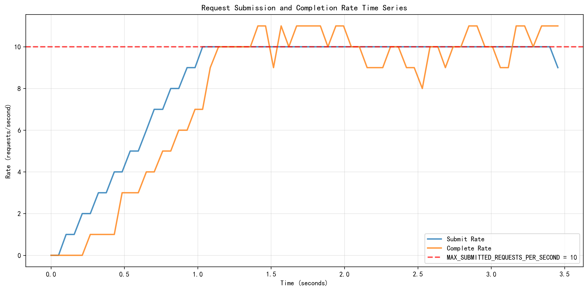
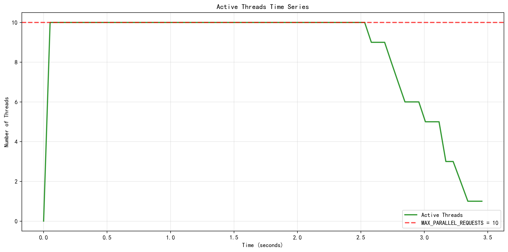

# PKU Treehole Starred Saver

## Introduction

This project is for saving your starred posts in PKU Treehole, including posts, images and comments, and saves the data in original JSON and Markdown formats (with image links and quote links) for easy viewing.


*The output markdown file of a post*


*Quote in the markdown file*

> [!NOTE]
> This project is not affiliated with Peking University nor the Peking University Youth Research Center.

## Usage

Clone the repository:

```bash
git clone git@github.com:EmptyBlueBox/PKU_Treehole_Starred_Saver.git
cd PKU_Treehole_Starred_Saver
```

Install dependencies with [uv](https://docs.astral.sh/uv/) :

```bash
uv sync
```

Copy `config.py` to `config_private.py` and enter your username and password in the new file.  

> [!WARNING]
> For security reasons, it is recommended to keep your credentials in `config_private.py` (which is ignored by version control) rather than `config.py`, especially if you plan to share your code. However, if you prefer, you can also fill in your credentials directly in `config.py`.

Run the crawler code, and the image and json files will be saved in the `Data` directory, as shown in the `Structure` section.

```bash
python crawler.py
```

Run the markdown converter code, and the markdown files will be saved in the `Data/PostMarkdown` directory, as shown in the `Structure` section.

```bash
python save_markdown.py --json Data/PostJson/202x-xx-xx-xx-xx-xx.json
```

Then all of your posts will be saved in the `Data/PostMarkdown/202x-xx-xx-xx-xx-xx/` directory. Just compress this directory and take it anywhere on earth!

## Structure

There will be three directories in the `Data` directory after running the code:

```
.
├── client.py
├── config_private.py
├── config.py
├── Analysis
│   ├── 2025-07-24-05-02-18-rate_analysis.png
│   ├── 2025-07-24-05-02-18-concurrency_analysis.png
│   ├── 2025-07-24-05-03-51-rate_analysis.png
│   └── 2025-07-24-05-03-51-concurrency_analysis.png
├── Data
│   ├── Image
│   │   ├── 1500000.gif
│   │   └── 7508259.jpeg
│   ├── PostJson
│   │   ├── 2025-07-24-05-02-18.json
│   │   └── 2025-07-24-05-03-51.json
│   └── PostMarkdown
│       ├── 2025-07-24-05-02-18
│       │   ├── Image
│       │   │   ├── 1500000.gif
│       │   │   └── 7508259.jpeg
│       │   ├── RawJson
│       │   │   └── 2025-07-24-05-02-18.json
│       │   ├── 1500000.md
│       │   ├── 7508259.md
│       │   └── 7541521.md
│       └── 2025-07-24-05-03-51
│           ├── Image
│           │   └── 7508259.jpeg
│           ├── RawJson
│           │   └── 2025-07-24-05-03-51.json
│           └── 7508259.md
├── crawler.py
├── pyproject.toml
├── README.md
├── save_markdown.py
└── uv.lock
```

- The `Image` directory contains all images downloaded for posts and comments. Each image file is named as `<pid>.<ext>`, where `pid` is the post ID (zero-padded to 7 digits, e.g., `0000123.jpg`), and `ext` is the original image file extension (such as jpg, jpeg, gif, etc.).

- The `PostJson` directory stores the raw data for each data collection session. Each file is named `<timestamp>.json`, where `timestamp` is the time when the data was collected (e.g., `2025-07-24-05-02-18.json`). Each JSON file contains a list of posts and their associated comments retrieved in that session.

- The `PostMarkdown` directory organizes the Markdown files generated for each post. For every data collection session, a subdirectory named after the corresponding JSON file is created. Inside each subdirectory, individual Markdown files are named `<pid>.md` (with zero-padded post IDs). Each Markdown file includes the post content, timestamp, all comments, and embeds image links (in relative paths to the `Image` directory) . If a comment quotes another, the quoted content is included for clarity.

- The `Analysis` directory contains the rate and concurrency analysis plots. Each plot is named `<timestamp>-rate_analysis.png` and `<timestamp>-concurrency_analysis.png`, where `timestamp` is the time when the data was collected (e.g., `2025-07-24-05-02-18`).

## Rate Limit and Concurrency Analysis

The `get_and_save_post_list` function enforces two types of limits to balance efficiency and avoid being blocked by the server:

1. **Submission Rate Limit (Token Bucket Algorithm):**
   - The number of requests that can be submitted per second is strictly controlled using a token bucket algorithm.
   - The parameter `MAX_SUBMITTED_REQUESTS_PER_SECOND` (set in `config.py` or `config_private.py`) determines the maximum average number of requests that can be initiated per second.
   - The token bucket ensures that even under high concurrency, the submission rate will not exceed this threshold. If the rate is exceeded, threads will wait until tokens become available.
   - Default: `MAX_SUBMITTED_REQUESTS_PER_SECOND = 10`.

2. **Concurrency Limit (Thread Pool):**
   - The maximum number of requests that can be processed simultaneously is controlled by the thread pool size, set by `MAX_PARALLEL_REQUESTS`.
   - This parameter determines how many threads can fetch posts and comments in parallel.
   - Increasing this value allows more requests to be in progress at the same time, but may increase local resource usage and risk overloading the server.
   - Default: `MAX_PARALLEL_REQUESTS = 10`.



*Rate analysis showing real-time submission and completion rates*



*Concurrency analysis showing the number of active threads over time*

**How it works:**
- Each thread in the pool must acquire a token from the token bucket before submitting a request. If no token is available, the thread waits, ensuring the submission rate never exceeds the configured limit.
- The thread pool ensures that no more than `MAX_PARALLEL_REQUESTS` requests are being processed at any given time, regardless of the submission rate.

**Tuning:**
- You can adjust both parameters in your `config_private.py` (recommended for personal settings) or `config.py` (default).
- Example:
  ```python
  MAX_SUBMITTED_REQUESTS_PER_SECOND = 10  # Submission rate limit (requests per second)
  MAX_PARALLEL_REQUESTS = 10              # Maximum number of concurrent requests
  ```
- If you want to speed up data collection, you may increase these values. However, setting them too high may result in your requests being blocked by the server or overloading your local system.

**Analysis and Monitoring:**
- After each run, the code will print a detailed analysis of the actual submission rate and concurrency, and save time series plots in the `Analysis` directory:
  - `<timestamp>-rate_analysis.png`: Shows the real-time submission and completion rates.
  - `<timestamp>-concurrency_analysis.png`: Shows the number of active threads over time.
- Use these plots to monitor the effect of your settings and avoid exceeding safe limits.

## To modify

You can also use this project to get a single post or a list of posts, but you'll have to manually modify the `crawler.py` file.

The `get_one_post_and_all_comments` function is used to get a single post and all its comments.

The `get_and_save_post_list` function is used to get a list of posts and save them to a JSON file and Markdown files.

The `get_and_save_followed_posts` function is used to get your starred posts and save them to a JSON file and Markdown files.

## Acknowledgments

This project refers to and utilizes code from [PKU Treehole Crawler](https://github.com/dfshfghj/PKUHoleCrawler-new). Many thanks to the original author!
